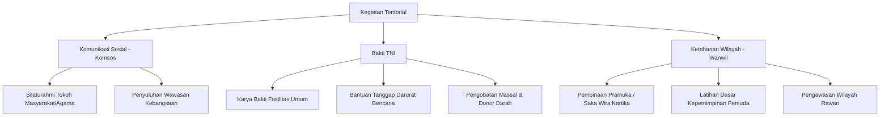

# Kegiatan Teritorial & Koramil

Modul **Kegiatan Teritorial** dan **Koramil** mengelola data pembinaan teritorial (Binter) satuan kewilayahan, mencakup pendataan markas Koramil dan dokumentasi aktivitas lapangan prajurit di masyarakat.

---

## Konsep Pembinaan Teritorial (Binter)

Dalam struktur komando TNI AD kewilayahan, Komando Rayon Militer (**Koramil**) merupakan ujung tombak pelaksanaan fungsi teritorial yang berhadapan langsung dengan dinamika kemasyarakatan.

Komando Satria Apps mendokumentasikan kegiatan teritorial ini untuk memudahkan:
1. **Pemantauan Kegiatan Lapangan**: Mengetahui penugasan bintara pembina desa (Babinsa) dan personel Koramil.
2. **Geotagging & Pemetaan**: Menampilkan koordinat lokasi kegiatan (latitude/longitude) untuk visualisasi geospasial.
3. **Dokumentasi & Pelaporan**: Menyimpan foto kegiatan lapangan dan dokumen laporan digital.
4. **Rekapitulasi Personel**: Menghitung pelibatan prajurit dalam setiap kegiatan pembinaan wilayah.

---

## 1. Data Koramil (`koramil`)

Tabel `koramil` menyimpan data induk kantor satuan komando kewilayahan di bawah Kodim.

### Struktur Data Koramil

| Field | Tipe | Keterangan |
| :--- | :--- | :--- |
| `id` | INT (PK) | Auto increment ID Koramil |
| `nama_koramil` | VARCHAR(150) | Nama lengkap (contoh: *Koramil 01/Sananwetan*) |
| `kode` | VARCHAR(50) | Kode penomoran satuan (contoh: *0808-01*) |
| `wilayah` | VARCHAR(150) | Wilayah kecamatan binaan |
| `alamat` | TEXT | Alamat kantor Koramil |
| `danramil` | VARCHAR(150) | Nama Komandan Koramil |
| `no_telp` | VARCHAR(50) | Nomor telepon kantor |
| `latitude` | DECIMAL(10,7) | Titik koordinat garis lintang kantor Koramil |
| `longitude` | DECIMAL(10,7) | Titik koordinat garis bujur kantor Koramil |

---

## 2. Kegiatan Teritorial (`territorial_activities`)

Tabel `territorial_activities` mencatat setiap aksi atau tugas operasional teritorial yang dilaksanakan personel.

### Struktur Data Kegiatan Teritorial

| Field | Tipe | Keterangan |
| :--- | :--- | :--- |
| `id` | INT (PK) | Auto increment ID aktivitas |
| `koramil_id` | INT (FK) | Relasi ke tabel `koramil` (satuan pelaksana) |
| `jenis_kegiatan` | VARCHAR(200) | Jenis/kategori kegiatan teritorial |
| `tanggal_kegiatan` | DATE | Tanggal pelaksanaan kegiatan |
| `lokasi` | VARCHAR(200) | Nama lokasi/desa/kelurahan sasaran |
| `latitude` | DECIMAL(10,7) | Koordinat latitude lokasi kegiatan |
| `longitude` | DECIMAL(10,7) | Koordinat longitude lokasi kegiatan |
| `deskripsi` | TEXT | Ringkasan dan narasi laporan kegiatan |
| `jumlah_personel` | INT | Jumlah prajurit yang dikerahkan |
| `foto_urls` | JSON | Kumpulan URL gambar dokumentasi kegiatan |
| `laporan_url` | TEXT | URL file lampiran laporan kegiatan (PDF/Doc) |
| `created_by` | INT (FK) | ID pengguna (operator/Babinsa) pembuat data |

---

## Jenis-Jenis Kegiatan Teritorial

Kegiatan yang dicatat umumnya diklasifikasikan ke dalam 3 metode utama Pembinaan Teritorial (Binter):



1. **Komunikasi Sosial (Komsos)**:
   - Silaturahmi dengan perangkat desa, tokoh masyarakat, dan tokoh agama.
   - Sosialisasi wawasan kebangsaan, toleransi, dan bela negara.
2. **Bakti TNI**:
   - Karya bakti pembersihan sungai, perbaikan saluran irigasi, dan bedah rumah warga.
   - Penanggulangan bencana alam (banjir, tanah longsor, kebakaran hutan).
   - Layanan kesehatan masyarakat dan bakti sosial sembako.
3. **Ketahanan Wilayah (Wanwil)**:
   - Pembinaan kelompok pramuka Saka Wira Kartika.
   - Pembinaan Linmas desa dan pengawasan pos kamling.
   - Pemetaan potensi sumber daya alam dan logistik wilayah pertahanan.

---

## Pengisian & Upload Bukti Kegiatan

Formulir pencatatan kegiatan teritorial menyediakan fitur dokumentasi multimedia:

1. **Titik Lokasi (Geotag)**:
   - Koordinat dapat diisi otomatis melalui GPS perangkat mobile atau dipilih via picker peta.
2. **Unggah Foto Dokumentasi (`foto_urls`)**:
   - Operator dapat melampirkan beberapa foto dokumentasi lapangan sekaligus (*multiple upload*).
   - Disimpan dalam bentuk array path JSON.
3. **Dokumen Laporan PDF (`laporan_url`)**:
   - Lembar laporan resmi bertanda tangan pimpinan dapat diunggah dalam format PDF.

---

## Seeder Database

Untuk mengisi data awal Koramil contoh, jalankan seeder spark:

```bash
php spark db:seed KoramilSeeder
```
